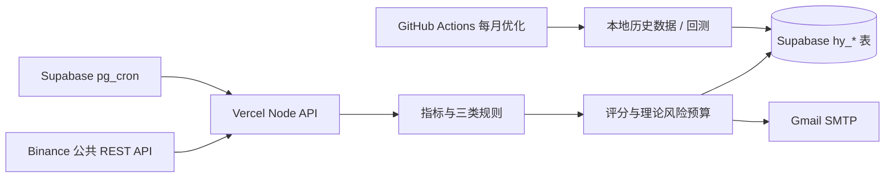

# HeYue 合约信号观察系统

面向 Binance USDT-M 永续合约的规则扫描、信号评分、理论止盈止损和 Gmail 提醒。当前边界是：只读取 Binance 公共行情，只发信号，不自动下单、不读取账户、不跟踪真实持仓。

## 当前实现

- 15 分钟扫描节奏；使用已收盘的 `15m`、`1h`、`4h` K 线。
- Binance 所有 USDT-M 永续合约进入轻量 universe；默认按 24 小时成交额选择前 100 个做深度技术扫描。
- 三类可复用规则：趋势、通道突破、均值回归；最终每个币种只保留评分最高的候选。
- 评分包含趋势一致性、动量、结构、流动性、波动率、市场状态适配和数据质量。
- 默认假设每笔保证金 100U、最大假设杠杆 20 倍、理论止盈 2R、参考最长持仓 72 小时。
- 单笔理论亏损超过 100U 会保留并醒目标记；每日理论风险预算 600U，预算不足的机会只入库不发邮件。
- 同一个币种只有一个 `ACTIVE` 信号；新信号评分不高于旧信号时拒绝替换，替换时只按风险增量计入每日预算。
- 每个 15 分钟扫描组最多预留 6 封邮件，每日最多 10 封；Gmail SMTP 使用 App Password。
- Supabase 写入或扫描主流程失败时，尝试绕过 Supabase 直接通过 Gmail SMTP 发送严重故障告警。
- 每个扫描批次把 market-data、候选、评分、方向、策略族、本地/全局状态、风险、成本、冷却、claim 和邮件结果写入 `hy_scan_diagnostics`；候选资格、claim 与 email delivery 是独立维度。Dashboard 将 Scanner Health 与 Strategy Observation Health 分开显示，按最后一次 signal/paper 活动计算连续无新前向样本时长。
- 扫描运行时的策略版本、入场模式、止损倍数、止盈倍数、方向/策略族过滤、市场状态约束、冷却时间和执行成本上限由 `.env.local` 集中配置；默认值保持提醒模式的原有行为。
- 策略生命周期为 `DRAFT → PAPER → ACTIVE → RETIRED`。当前候选只允许 `PAPER` 观察；未达到 200 笔前向 OOS 信号前不能切换为 `ACTIVE`。
- Supabase 只保存 `hy_` 前缀的最新结果、信号事件、扫描状态和优化结果；原始历史行情放在本地 `data/raw/`，不会提交到公开仓库。

## 架构



Vercel Hobby 的 Cron 不适合作为 15 分钟调度器，因此调度模板放在 [`supabase/scheduler.sql`](./supabase/scheduler.sql)，由 Supabase pg_cron 以 4 个批次调用 Vercel。邮件发送放在 Vercel Node runtime，因为 Supabase Edge Functions 的免费运行环境不适合 Gmail SMTP 端口。

## 本地运行

```powershell
Copy-Item .env.example .env.local
# 填入 HY_SUPABASE_SERVICE_ROLE_KEY、HY_CRON_SECRET 和 Gmail App Password
pnpm install
pnpm dev
```

健康检查：`GET /api/health`

扫描接口：`POST /api/scan?batch=0`，请求头使用 `Authorization: Bearer <HY_CRON_SECRET>`。默认一轮深度扫描有 4 个批次：`batch=0..3`。本地测试时建议先将 `HY_DRY_RUN=true`，它不会实际发邮件。

## Supabase

其他项目的历史迁移已移到 `supabase/foreign-project-migrations/`，不在 HeYue 的可执行迁移路径中。`supabase/migrations/` 只保留独立的 `hy_` 基线：

- `hy_instruments`、`hy_scan_runs`、`hy_signals`、`hy_signal_events`
- `hy_risk_budgets`、`hy_notifications`、`hy_system_events`、`hy_scan_diagnostics`
- `hy_strategy_versions`、`hy_backtest_runs`、`hy_app_settings`、`hy_paper_trades`
- HeYue 的表、函数和触发器应与其他项目隔离；在确认迁移基线前，不执行任何跨前缀重命名

所有新表已启用 RLS，未给匿名用户创建策略；服务端使用 Supabase service key。不要把 service key、Gmail App Password 或 `HY_CRON_SECRET` 放入公开仓库或 `NEXT_PUBLIC_*` 变量。

部署到 Vercel 后：

1. 在 Vercel 环境变量中设置 `.env.example` 的服务端变量，观察版必须设置 `HY_STRATEGY_STAGE=PAPER`、`HY_STRATEGY_SOURCE=DB`、`HY_PAPER_TRADING_ENABLED=true` 和 `HY_DRY_RUN=false`。
2. 在 Supabase Vault 中保存 `hy_scan_url` 和 `hy_cron_secret`。
3. 运行 `pnpm deploy:check`；只有目录、Supabase 项目、PAPER 状态、邮件配置、`hy_` 隔离和“无交易所私钥”全部通过才允许部署。
4. 按 [`supabase/scheduler.sql`](./supabase/scheduler.sql) 创建 `hy-paper-settle` 和 `hy-scan-batch-0`。这不会改动数据库中已有的其他业务 Cron。

GitHub Actions 月度优化需要配置仓库 Secrets：`HY_SUPABASE_URL`、`HY_SUPABASE_SERVICE_ROLE_KEY` 和 `HY_HISTORY_SYMBOLS`。原始行情只存在于该次 Actions runner 的 `data/raw/`，不会写入 Supabase 或提交到公开仓库。

## 回测与参数优化

先设置 `HY_HISTORY_SYMBOLS`，再运行 `pnpm history:download` 从 Binance 公共接口下载本地历史 K 线和资金费率；建议先从 BTC/ETH 等少量代表币种开始，确认存储空间和运行时间后再扩大到更多币种。`pnpm optimizer` 从 `data/raw/*.json` 读取本地历史数据，生成 54 组参数变体，按 9 个月训练 + 3 个月样本外评估，并以最大回撤 30% 作为资格线。合格的版本写入 `hy_strategy_versions`，运行摘要写入 `hy_backtest_runs`。

数据文件需要包含一个 symbol、交易所过滤器和至少一年的已收盘 `15m` K 线，可选带 `1h`、`4h` K 线。数据不足一年时不会被标记为合格。原始文件被 `.gitignore` 排除。

当前纸面候选使用评分 80、24 小时冷却、2R 止盈和 48 小时最长持有。参数只按前九个月训练结果排序，最后三个月仅用于报告；回测在下一根 15 分钟 K 线开盘成交，并对跳空止损按更差开盘价处理。最新基础成本、高成本和前后对比见 `reports/optimization-comparison-20260809.json`。该候选尚未达到 200 笔 OOS 信号门槛，因此默认策略来源为 DB 且必须显式审批，当前只允许纸面前向验证。

研究用的 `HY_VALIDATION_FOCUS=production-parity` 会在可获得的历史候选池中按每个时间点的 trailing 24 小时 quote volume 选 dynamic top 10，并使用独立的 `PRODUCTION_CLAIM_PARITY` 模拟：cooldown 以 signal source timestamp 为基准，同 symbol replacement 只计增量风险，不应用并发仓位或 realized-loss gate，email cap 只影响 delivery 指标。报告保留 `universePolicy`、`candidatePoolSize`、`volumeSource`、`productionParityLevel` 和 `survivorshipBiasLimitation` 元数据。显式 `HY_VALIDATION_SYMBOLS` 只能标记为 `FIXED_COHORT_DYNAMIC_TOP10` / `BOUNDED_COHORT`，不会冒充完整历史 Binance universe。新下载的 Binance Kline 使用真实 quote asset volume；旧 cache 缺少该字段时使用 `close * baseVolume`，报告会标记 `ESTIMATED_CLOSE_X_BASE_VOLUME` 或 `MIXED_WITH_FALLBACK`。

## 风险边界

评分不是盈利保证。实盘前必须人工核对标记价格、盘口深度、滑点、手续费、资金费率、逐仓设置、实际数量精度和强平距离。系统不判断你的真实账户余额，也不会在 72 小时到期时自动平仓或发送失效通知。
